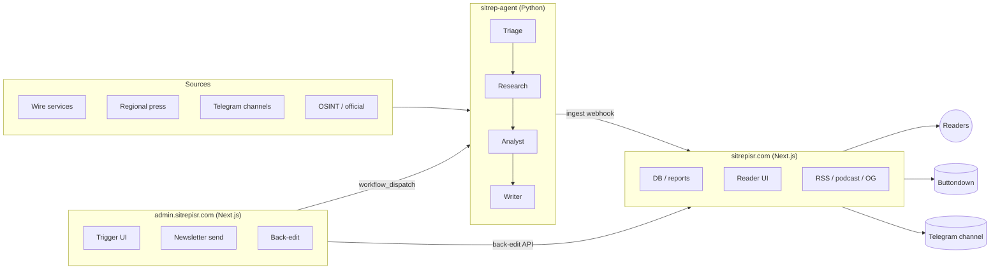

# Architecture

SITREP ISR is four moving parts, deliberately split so each can deploy and fail independently.

## The four parts

### 1. Public site — `sitrepisr.com`

Next.js app. Hosts the reader UI, database of SITREPs and simulations, RSS/podcast feeds, and the ingest webhook that the agent posts into. Deployed on Vercel.

Repo: [`danielrosehill/SITREP_ISR`](https://github.com/danielrosehill/SITREP_ISR).

### 2. Agent — `sitrep-agent`

Python package (`agent/sitrep_agent/`) that does the actual work of producing a SITREP:

1. Pulls recent material from the source whitelist.
2. Filters, triages, researches, analyses, writes.
3. Posts the finished SITREP to the public site's admin-ingest endpoint.

Runs on a schedule in GitHub Actions (`on-demand-sitrep.yml`), or on demand via `workflow_dispatch` from the admin surface.

Lives inside the public-site repo under `agent/`.

### 3. Admin surface — `admin.sitrepisr.com`

Next.js app in a **separate repo**, with its own Vercel deploy. Carries its own auth middleware and secrets. Responsibilities:

- "Fire a SITREP" button → dispatches the GitHub Actions workflow on the public-site repo with whatever knobs the operator sets (coverage window, include-URLs, etc.).
- Newsletter preview + send (Buttondown).
- Back-edit / correction UI for already-published reports.

Repo: [`danielrosehill/SITREP-ISR-Admin`](https://github.com/danielrosehill/SITREP-ISR-Admin).

Split from the public site on 2026-04-20 so admin could evolve without redeploying the reader surface, and so admin auth scope stays off the public domain.

### 4. Outbound channels

- **Newsletter** — Buttondown. Triggered from admin after a SITREP lands.
- **Telegram channel** — `t.me/israel_sitreps`. Posted automatically as part of the publish step.
- **Podcast** — each SITREP is auto-narrated and pushed to Apple Podcasts / Spotify via the podcast RSS feed on the public site.

## Why it's split this way

- **Independent deploy cadence.** Admin changes don't need a public-site redeploy, and vice versa.
- **Blast radius.** A bug in the admin surface can't take down the reader.
- **Auth scoping.** Admin sits behind middleware the public site doesn't need.
- **Rollback is per-surface.** Reverting admin doesn't touch published reports.

## The sync rule

Any pipeline knob added to the agent that an operator might plausibly want to trigger from the browser **must** be mirrored across four layers:

| Layer | Where |
|---|---|
| CLI flag / agent state | `agent/sitrep_agent/cli.py` + `state.py` |
| Workflow input | `.github/workflows/on-demand-sitrep.yml` |
| API passthrough | Admin repo `src/app/api/trigger/sitrep/route.ts` |
| UI control | Admin repo `src/app/admin/page.tsx` |

If you only wire three of the four, you'll ship a feature the operator can't reach.
