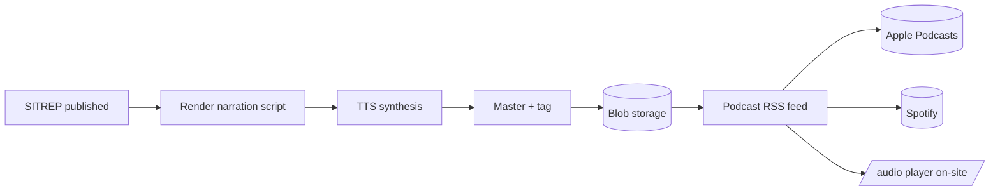

# Audio / podcast pipeline

Every published SITREP is auto-narrated and pushed to the podcast feed. No operator involvement in the happy path.

## Flow

## Stages

### 1. Render narration script

The published SITREP's markdown is rewritten into narration-friendly copy: abbreviations expanded, citations dropped, section transitions softened. House-voice prompting ensures consistent register across episodes.

### 2. TTS synthesis

The script is synthesised to audio. Output is normalised to podcast-standard loudness (–16 LUFS integrated, true peak ≤ –1 dBFS).

### 3. Master + tag

- Loudness normalisation
- Silence trim
- ID3 tags (title, episode number, description, publication date)
- Cover art embedded

### 4. Store + serve

- Audio uploaded to Vercel Blob storage.
- `podcast.xml` on the public site regenerates on demand from the database.
- Apple Podcasts and Spotify poll the feed; new episodes appear automatically.

## Backfill

A separate workflow, [`backfill-audio.yml`](https://github.com/danielrosehill/SITREP_ISR/blob/main/.github/workflows/backfill-audio.yml), re-runs audio synthesis for SITREPs that were published before the audio pipeline existed, or where the original render failed.

## Short links

For convenience, the public site serves redirect short-links to the external podcast platforms:

- `sitrepisr.com/spotify` → Spotify show page
- `sitrepisr.com/apple-podcasts` → Apple Podcasts show page
- `sitrepisr.com/podcast` → podcast landing page with all channels

In-browser playback (without a podcast app) is available at `sitrepisr.com/audio`.
