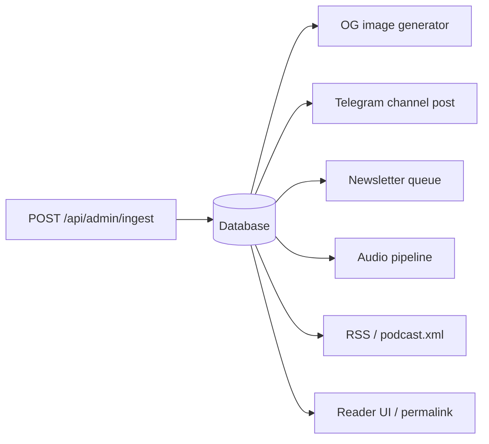

# Publication & delivery

What happens after the agent posts a finished SITREP to the ingest endpoint.

## Fan-out

## Channels

### Reader UI — the permalink

Each SITREP gets a permanent URL at `sitrepisr.com/update/<slug>`. The reader view is the canonical artefact; every other channel links back to it.

### Telegram channel

Posted automatically on ingest by `agent/sitrep_agent/publish.py` (or the ingest handler). Message contains BLUF + permalink. No commentary, no follow-ups.

Channel: [`t.me/israel_sitreps`](https://t.me/israel_sitreps) (short link: `sitrepisr.com/telegram`).

If a SITREP was triggered by a Telegram bot interaction, the publish notification threads as a reply (`reply_chat_id` / `reply_message_id`).

### Newsletter

Delivered via Buttondown. The admin surface handles preview + send — the site does not auto-send on ingest, to give the operator a moment to sanity-check the rendered email before fan-out.

Signup: [sitrepisr.com/subscribe/newsletter](https://sitrepisr.com/subscribe/newsletter) (short link: `sitrepisr.com/newsletter`).

### RSS

Two feeds:

- `/rss.xml` — SITREPs.
- `/api/rss/simulations` — simulations (separate stream so subscribers can opt into one without the other).

### Podcast

`/podcast.xml` is the Apple/Spotify-compatible feed. See [audio pipeline](audio.md).

## Back-edits / corrections

Corrections are handled from the admin surface and written through the public site's back-edit API. Key rules:

- Corrections are **dated in place**, not silently overwritten.
- The OG image regenerates after an edit.
- A correction does **not** re-trigger newsletter send or Telegram post — corrections are visible on-site but don't re-spam subscribers.

## Monitoring

- GitHub Actions logs per run (the runtime is per-invocation — no always-on worker to monitor).
- Failed ingest calls surface in Vercel logs.
- Heartbeat runs that found nothing to publish write a marker so a gap in the public feed can be distinguished from a broken pipeline.
