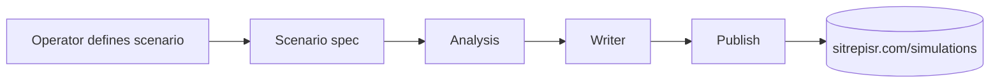

# Simulation runner

!!! note "Status"
    The simulation runner is deliberately lighter-weight than the SITREP generation pipeline. This page reflects the current implementation; expect it to expand.

Simulations are **scenario explorations**, not predictions. A simulation takes a defined scenario (e.g. "ceasefire holds for 30 days", "strike on X facility") and produces a structured multi-track readout of plausible near-term dynamics, explicitly flagged as counterfactual.

Published simulations live at [sitrepisr.com/simulations](https://sitrepisr.com/simulations).

## How it differs from a SITREP

| | SITREP | Simulation |
|---|---|---|
| Trigger | Scheduled + manual | Manual only |
| Input | Real-world events in the last *N* hours | An operator-defined scenario |
| Time horizon | Now | Near-future / counterfactual |
| Sources | Live source whitelist | Background knowledge + optionally cited sources |
| Confidence posture | "What can we say is true?" | "What follows if the scenario holds?" |
| Reader framing | Reporting | Modelling — explicitly marked as speculative |

## Pipeline

### 1. Scenario spec

The operator provides:

- **Premise** — the counterfactual or hypothetical being modelled.
- **Constraints** — what is held constant, what is allowed to vary.
- **Time horizon** — how far forward the simulation runs.
- **Tracks** — which axes to analyse along (military, political, economic, humanitarian, etc.).

### 2. Analysis

An LLM step that walks the scenario along each track, naming assumptions and flagging forks where the outcome is genuinely uncertain. Same "prefer unclear over confident" posture as the SITREP analyst stage.

### 3. Writer

Produces the final simulation document in the house format: framing box (scenario + caveats), per-track readouts, key uncertainties, things that would change the picture.

### 4. Publish

Posts to the same admin ingest endpoint the SITREP pipeline uses, but with a `kind=simulation` marker so the public site routes it to `/simulations/<slug>` rather than `/update/<slug>`.

## What's explicitly out of scope

- **Forecasting probabilities** beyond coarse qualitative bands. The pipeline does not produce calibrated probability estimates.
- **Red-team / adversarial simulation** of specific operations. Not something this surface is intended for.
- **Live simulation updating.** Once published, a simulation is a point-in-time artefact. Updates mean publishing a new simulation with explicit reference to the prior one.

## Reader disclaimer

Every published simulation carries a visible framing box making clear that the content is counterfactual modelling and should not be read as reporting or prediction. See [sitrepisr.com/about/simulations](https://sitrepisr.com/about/simulations).
