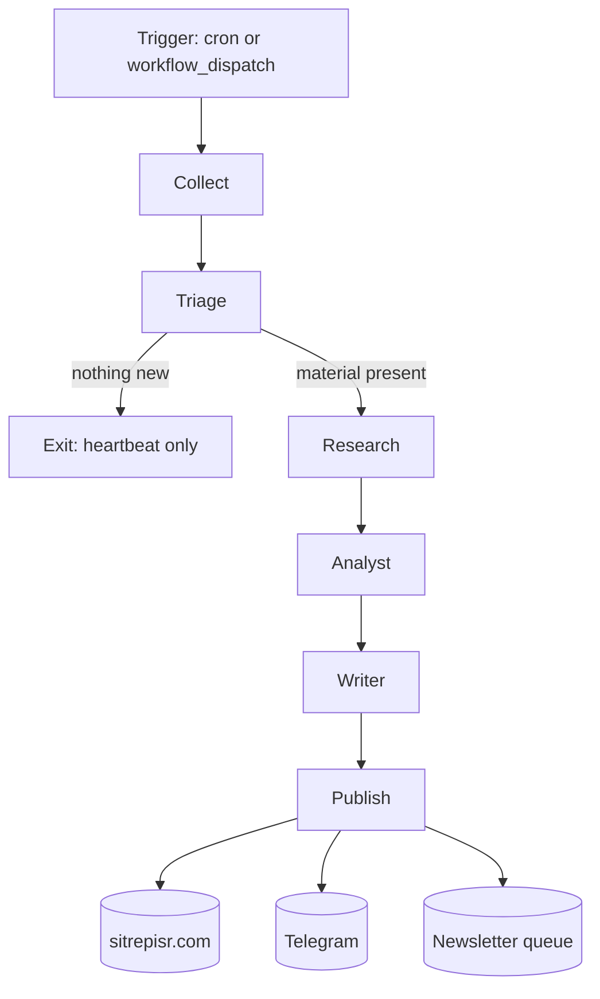

# SITREP generation

The core pipeline. Produces one situation report per run.

## Overview

## Runtime

- **Language:** Python 3.12+, `uv`-managed.
- **Package:** `agent/sitrep_agent/` in the main site repo.
- **Entry point:** `uv run sitrep-agent run` (wired in `cli.py`).
- **Execution host:** GitHub Actions — `.github/workflows/on-demand-sitrep.yml`. There is no persistent worker.
- **Schedule:** every 6 hours (four runs per day). Also dispatchable manually from the admin surface.

## Stages

### 1. Collect

Pulls recent material across several ingestion methods:

- **RSS / Atom** — for sources with a published feed.
- **HTML scrape** — targeted scrape of homepages / listing pages where feeds are unreliable.
- **Telegram scrape** — public channel message fetch (`telegram_scrape.py`).
- **Exa search** — domain-filtered Exa queries (`exa.py`) for coverage where feeds are missing.
- **Manual URLs** — operator-supplied URLs via `--include-url` / admin form, bypassing whitelist and coverage window.

Every fetched item is normalised into a common shape (url, source, title, published_at, body) and clamped to a rolling coverage window (default: 6 hours, overridable per run).

### 2. Triage

`agent/sitrep_agent/nodes/triage.py`.

Decides whether this run is even worth doing. Drops duplicates, filters low-signal items, and checks for a meaningful delta against the last published SITREP. If there's nothing new — and no manual URLs were supplied — the run exits with a heartbeat instead of publishing a near-duplicate report.

**Override:** manual `--include-url` inputs force-bypass the heartbeat / short-delta gate.

### 3. Research

`agent/sitrep_agent/nodes/research.py`.

For each surviving item, pulls additional context: follows inline links (within the whitelist), cross-references the same event across other sources, pulls related Telegram messages where relevant. The goal is to give the Analyst stage more than a headline.

### 4. Analyst

`agent/sitrep_agent/nodes/analyst.py`.

Consolidates the researched material into a structured intermediate representation: event list, actors, tracks (military / diplomatic / domestic / humanitarian), claim provenance, confidence notes.

This stage is where the "don't overstate confidence" prompting lives. The analyst is instructed to prefer `unclear` over a confident guess and to tag every forward-looking claim with a confidence level.

### 5. Writer

`agent/sitrep_agent/nodes/writer.py`.

Turns the analyst's structured output into the final SITREP markdown — BLUF, key developments, tracks, outlook. Enforces the house format (length, tone, source citation style).

### 6. Publish

`agent/sitrep_agent/publish.py`.

Posts the finished SITREP to the public site's `/api/admin/ingest` endpoint. The site:

1. Writes the record to the database.
2. Generates the OG image.
3. Queues the newsletter send.
4. Pushes to the Telegram channel.
5. Triggers the audio pipeline.

## Graph orchestration

Stages are wired together in `agent/sitrep_agent/graph.py`. The intermediate state between stages lives in `agent/sitrep_agent/state.py` — this is the single source of truth for what each node reads and writes.

## Tunable knobs

Exposed as CLI flags, workflow inputs, and admin UI controls (see the [sync rule](../architecture.md#the-sync-rule)):

| Knob | Effect |
|---|---|
| `coverage_hours` | Size of the rolling coverage window in hours (default 6, range 1–168). |
| `include_urls` | List of URLs to force into the run, bypassing whitelist and coverage window. Also overrides the heartbeat gate. |
| `reply_chat_id` / `reply_message_id` | For Telegram-bot-initiated runs; threads the publish notification as a reply. No admin UI. |

## What's **not** here

- No private intelligence feeds.
- No paid-news scraping through paywalls.
- No model fine-tuning — all LLM work is prompt-driven against frontier models via OpenRouter.
- No retrieval cache across runs — each run is fresh (by design, to avoid stale framing).
